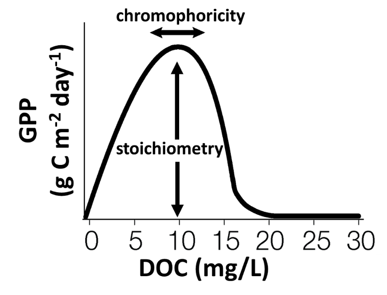

<!-- badges: start -->

<!-- badges: end -->

## Welcome! :wave: 
This is a repo for a GLEON project in which we are synthesizing global lake metabolism data and using it to test a newly development lake ecosystem model that predicts pelagic gross primary production.

## Collaborators
I am leading this project with input from many co-authors and data providers. A list of participants is [here](https://docs.google.com/spreadsheets/d/14FQnQPgZ-pgy7uB7kFIcMt7frfEgLC2RvRmYzuu9jlE/edit?usp=sharing).

## Structure
This is very much a work in progress, but in the mean time if you want to browse some draft output, feel free to poke around the `figures` folder.

## Objectives

It is well-known and accepted that light and nutrients are the main controls on pelagic primary production in lakes. However, widespread and ongoing environmental change are altering nutrient loads and the light environment in lakes through processes like eutrophication and so-called brownification. While substantial research in drivers of pelagic primary production in lakes has been conducted over the last few decades, the responses are often context-dependent. We need a predictive understanding of how primary production in waterbodies will respond to ongoing environmental change.

In 2018, <a href="https://doi.org/10.1007/s10021-018-0226-4">Kelly et al. published a paper in Ecosystems</a> that presented a predictive model that can be used to understand current spatial patterns of lake GPP and potentially predict future responses. The model predicts a unimodal relationship between GPP and DOC. The magnitude of the peak is determined by the stoichiometry of the DOC to nutrient load, while the location of the peak along the x-axis is mainly determined by lake area. It is predicted that when nutrients are provided in greater supply relative to DOC, primary productivity should be high. In large lakes, light limitation for primary producers should occur at a lower DOC concentration relative to smaller lakes due to the positive relationship between lake area and epilimnion depth.

 

In this study, we synthesized data from a globally distributed set of lakes associated with the GLEON network and test this newly developed model. Specifically, we asked: (1) how does pelagic GPP vary as a function of incoming DOC, nutrient load stoichiometry, hydrologic residence time, and lake size? Further, (2) does a model developed in the north temperature lakes hold for other lake regions of the world?
